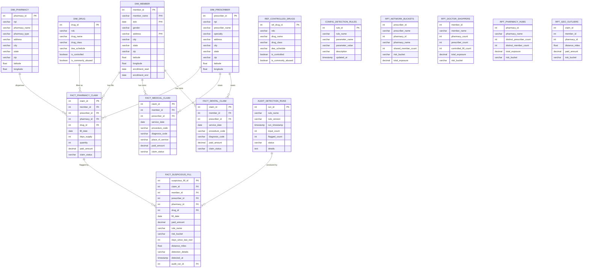

# Architecture — Network Graph

## System Overview

```
┌─────────────┐     ┌─────────────┐     ┌─────────────┐
│  React SPA  │────▶│  FastAPI     │────▶│  PostgreSQL  │
│  (Vite)     │     │  /api/       │     │  network_graph│
└─────────────┘     └─────────────┘     └─────────────┘
                          │
                    ┌─────┴─────┐
                    │ network_  │
                    │ graph_core│
                    │ (detectors)│
                    └───────────┘
```

## Entity Relationship Diagram



## Detection Pipeline

```
Claims Data ──▶ Suspicious Fill Detector (R1)
             ──▶ Network Bucket Detector (R2)
             ──▶ Doctor Shopping Detector (R4.2)
             ──▶ Pharmacy Hub Detector (R4.3)
             ──▶ Geo Anomaly Detector (R6)
                      │
                      ▼
              FACT_SUSPICIOUS_FILL
              RPT_* Summary Views
                      │
                      ▼
              API ──▶ Frontend / Power BI
```

## Key Design Patterns

1. **Detector Interface**: Each detector is a pure function: `detect(df, config) -> DataFrame`
2. **Config-Driven**: All thresholds in `CONFIG_DETECTION_RULES`, loaded at detection time
3. **Audit Trail**: Every detection run logs to `AUDIT_DETECTION_RUNS`
4. **Star Schema**: Fact tables reference dimension tables via integer FKs for Power BI compatibility
